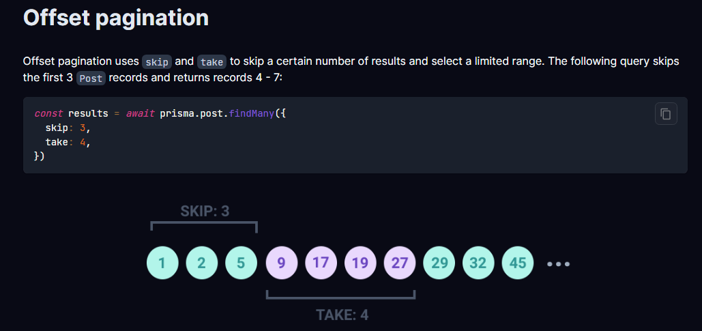
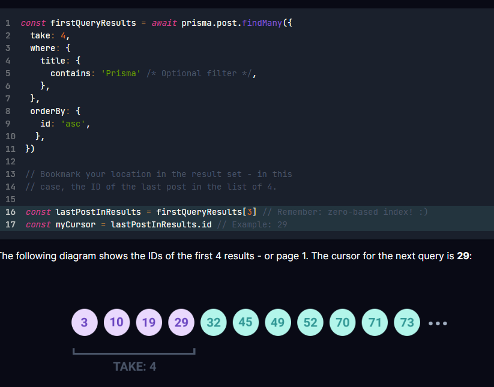
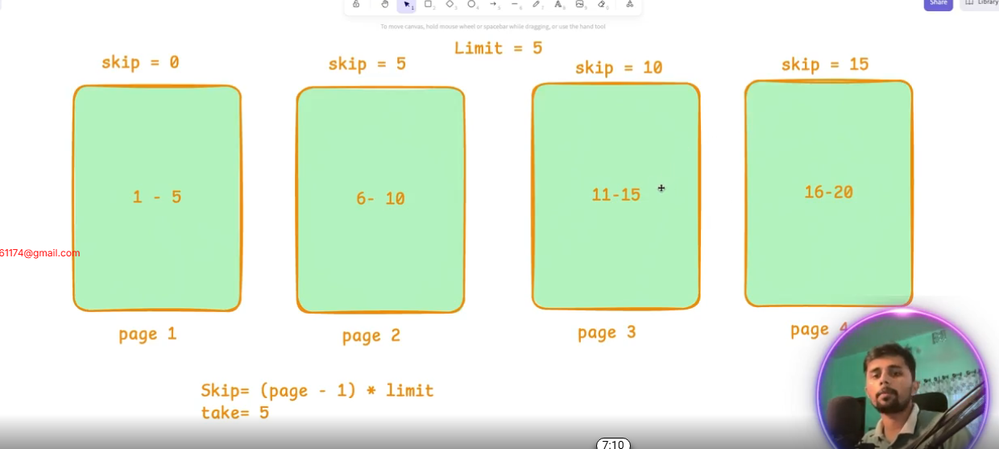

# EXPLORING-PRISMA-WITH-BLOG-APPLICATION-PART-2
Previous Module Task Solution: https://github.com/Apollo-Level2-Web-Dev/next-blog-server/tree/task


GitHub Link: https://github.com/Apollo-Level2-Web-Dev/next-blog-server/tree/part-2


## 50-1 Prisma Pagination Explained
- Prisma Client supports both offset pagination and cursor-based pagination.

#### Offset pagination
-  Offset pagination uses skip and take to skip a certain number of results and select a limited range. The following query skips the first 3 Post records and returns records 4 - 7:

```ts
const results = await prisma.post.findMany({
  skip: 3,
  take: 4,
})
```



#### Cursor Based Pagination 

- Cursor-based pagination uses cursor and take to return a limited set of results before or after a given cursor. A cursor bookmarks your location in a result set and must be a unique, sequential column - such as an ID or a timestamp.

The following example returns the first 4 Post records that contain the word "Prisma" and saves the ID of the last record as myCursor:

```ts 
const firstQueryResults = await prisma.post.findMany({
  take: 4,
  where: {
    title: {
      contains: 'Prisma' /* Optional filter */,
    },
  },
  orderBy: {
    id: 'asc',
  },
})
```

// Bookmark your location in the result set - in this
// case, the ID of the last post in the list of 4.

- we will hit in postman 

```sql
{{url}}/post?page=1&limit=3
```
- lets make it work 

## 50-2 Pagination & Searching


- pagination logic 



- post.controller.ts 

```ts
const getAllPosts = async (req: Request, res: Response) => {
    try {
        const page = Number(req.query.page) || 1;
        const limit = Number(req.query.limit) || 10;

        const result = await PostService.getAllPosts({page,limit});
        res.json(result);
    } catch (err) {
        res.status(500).json({ error: "Failed to fetch posts", details: err });
    }
};
```

- post.service.ts 

```ts 
const getAllPosts = async ({ page, limit }: { page: number, limit: number }) => {
    console.log(page, limit)
    const skip = (page - 1) * limit
    const result = await prisma.post.findMany({
        skip,
        take: limit
    });
    return result;
};
```
#### now lets figure out the searching 

- postman hit 

```
{{url}}/post?page=1&limit=3&search=Deploying
```
- post.controller.ts 

```ts 
const getAllPosts = async (req: Request, res: Response) => {
    try {
        const page = Number(req.query.page) || 1;
        const limit = Number(req.query.limit) || 10;
        const search = (req.query.search as string) || ""

        const result = await PostService.getAllPosts({page,limit, search});
        res.json(result);
    } catch (err) {
        res.status(500).json({ error: "Failed to fetch posts", details: err });
    }
};

```
- post.service.ts 

```ts 
const getAllPosts = async ({ page, limit, search }: { page: number, limit: number, search :string }) => {
    console.log(page, limit)
    const skip = (page - 1) * limit
    const result = await prisma.post.findMany({
        skip,
        take: limit,
        where  :{
            OR : [
                {
                    title : {
                        contains : search,
                        mode: 'insensitive'
                    }
                },
                {
                    content : {
                        contains : search,
                        mode: 'insensitive'
                    }
                }
            ]
        }
    });
    return result;
};
```
## 50-3 Filtering Data with Prisma (Part 1)
- post.controller.ts 

```ts 
const getAllPosts = async (req: Request, res: Response) => {
    try {
        const page = Number(req.query.page) || 1;
        const limit = Number(req.query.limit) || 10;
        const search = (req.query.search as string) || ""
        const isFeatured = req.query.isFeatured ? req.query.isFeatured ==="true": undefined

        const result = await PostService.getAllPosts({page,limit, search, isFeatured});
        res.json(result);
    } catch (err) {
        res.status(500).json({ error: "Failed to fetch posts", details: err });
    }
};
```

- post.service.ts 

```ts 
const getAllPosts = async ({ page = 1, limit = 10, search, isFeatured }: { page?: number, limit?: number, search?: string, isFeatured?: boolean }) => {

    console.log(page, limit)
    const skip = (page - 1) * limit


    console.log({ isFeatured })
    const where: any = {
        AND: [
            search && {
                OR: [
                    {title: {contains: search, mode: 'insensitive'}},
                    {content: {contains: search,mode: 'insensitive'}}
                ]
            },
            typeof isFeatured === "boolean" && {isFeatured }
        ].filter(Boolean) // for filtering we have to tell explicitly 
    }
    const result = await prisma.post.findMany({
        skip,
        take: limit,
        where
    });
    return result;
};
```

- postman hit 

```
{{url}}/post?isFeatured=false
```

## 50-4 Advanced Filtering in Prisma (Part 2)
- filtering based on the tags 

- post.controller.ts 

```ts 
const getAllPosts = async (req: Request, res: Response) => {
    try {
        const page = Number(req.query.page) || 1;
        const limit = Number(req.query.limit) || 10;
        const search = (req.query.search as string) || ""
        const isFeatured = req.query.isFeatured ? req.query.isFeatured ==="true": undefined
        const tags = req.query.tags? (req.query.tags as string).split(",") :[]

        const result = await PostService.getAllPosts({page,limit, search, isFeatured, tags});
        res.json(result);
    } catch (err) {
        res.status(500).json({ error: "Failed to fetch posts", details: err });
    }
};
```
- for matching array element we can use `hasEvery`

```ts 
const getAllPosts = async ({ page = 1, limit = 10, search, isFeatured, tags }: { page?: number, limit?: number, search?: string, isFeatured?: boolean, tags?:string[] }) => {

    console.log(page, limit)
    const skip = (page - 1) * limit


    console.log({ tags })
    const where: any = {
        AND: [
            search && {
                OR: [
                    {title: {contains: search, mode: 'insensitive'}},
                    {content: {contains: search,mode: 'insensitive'}}
                ]
            },
            typeof isFeatured === "boolean" && {isFeatured },
            tags && tags?.length > 0 && {tags:{hasEvery : tags}}
        ].filter(Boolean) // for filtering we have to tell explicitly 
    }
    const result = await prisma.post.findMany({
        skip,
        take: limit,
        where
    });
    return result;
};

```

## 50-5 Sorting & Metadata Techniques
- sorting and meta data 
- post.controller.ts 

```ts
const getAllPosts = async (req: Request, res: Response) => {
    try {
        const page = Number(req.query.page) || 1;
        const limit = Number(req.query.limit) || 10;
        const search = (req.query.search as string) || ""
        const isFeatured = req.query.isFeatured ? req.query.isFeatured ==="true": undefined
        const tags = req.query.tags? (req.query.tags as string).split(",") :[]
        const sortBy = (req.query.sortBy as string) || "createAt"
        const sortOrder = (req.query.sortOrder as string) || "desc"

        const result = await PostService.getAllPosts({page,limit, search, isFeatured, tags, sortBy, sortOrder});
        res.json(result);
    } catch (err) {
        res.status(500).json({ error: "Failed to fetch posts", details: err });
    }
};


```

- post.service.ts

```ts 
const getAllPosts = async ({ page = 1, limit = 10, search, isFeatured, tags, sortBy, sortOrder }: { page?: number, limit?: number, search?: string, isFeatured?: boolean, tags?: string[], sortBy: string, sortOrder:string }) => {

    console.log(page, limit)
    const skip = (page - 1) * limit


    // console.log({ tags })
    const where: any = {
        AND: [
            search && {
                OR: [
                    { title: { contains: search, mode: 'insensitive' } },
                    { content: { contains: search, mode: 'insensitive' } }
                ]
            },
            typeof isFeatured === "boolean" && { isFeatured },
            tags && tags?.length > 0 && { tags: { hasEvery: tags } }
        ].filter(Boolean) // for filtering we have to tell explicitly 
    }
    const result = await prisma.post.findMany({
        skip,
        take: limit,
        where,
        orderBy : {
            [sortBy] : sortOrder
        }
    });
    const total = await prisma.post.count({where})

    return {
        data: result,
        pagination: {
            page,
            limit,
            total,
            totalPages : Math.ceil(total/limit)
        },
    };
};
```
## 50-6 Prisma Transaction API(same as transaction rollback)
- post.service.ts
```ts 
const getPostById = async (id: number) => {
    return await prisma.$transaction(async (tx) => {
        await tx.post.update({
            where: { id },
            data: {
                views: {
                    increment: 1
                }
            }
        });
        return await tx.post.findUnique({
            where: { id },
            include: { author: true },
        });


    })
};
```

## 50-7 Email & Password Authentication

- auth.routes.ts 

```ts 
import express from 'express';
import { AuthController } from './auth.controller';


const router = express.Router();

router.post(
    "/",
    AuthController.loginWithEmailAndPassword
)


export const AuthRouter = router;
```
- auth.controller.ts 

```ts 
import { Request, Response } from "express";
import { AuthServices } from "./auth.service";

const loginWithEmailAndPassword = async (req: Request, res: Response) => {
    try {
        const result = await AuthServices.loginWithEmailAndPassword(req.body)
        res.status(200).json(result);
    } catch (error) {
        res.status(500).send(error)
    }
}

export const AuthController = {
    loginWithEmailAndPassword
}
```
- auth.service.ts 

```ts 
import { prisma } from "../../config/db"

/* eslint-disable no-console */
const loginWithEmailAndPassword = async ({ email, password }: { email: string, password: string }) => {
    console.log({ email, password })
    const user = await prisma.user.findUnique({
        where: {
            email
        }
    })
    if (!user) {
        throw new Error("User Not Found!")
    }

    if (password === user.password) {
        return user
    }
    else {
        throw new Error("Password Incorrect!")
    }
}

export const AuthServices = {
    loginWithEmailAndPassword
}
```
